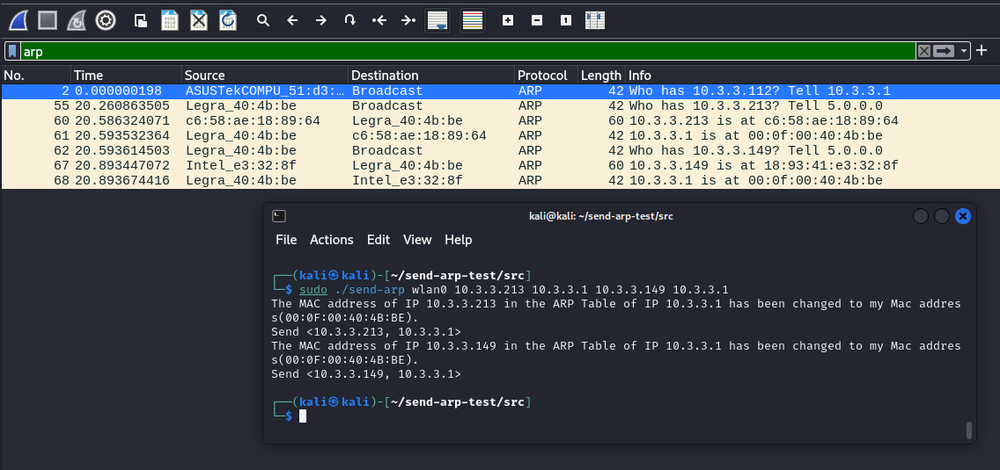

# send-arp


## 과제

> Sender(Victim)의 ARP table을 변조하라.

실행

``` bash
syntax : send-arp <interface> <sender ip> <target ip> [<sender ip 2> <target ip 2> ...]
sample : send-arp wlan0 192.168.10.2 192.168.10.1
```

## 결과


## 상세


Sender는 보통 Victim이라고도 함.


Target은 일반적으로 gateway임.


Sender와 Target은 하나만 있는 게 아니라 여러개의 (Sender, Target) 조합을 처리할 수 있도록 한다.


구글링을 통해서 ARP header의 구조(각 필드의 의미)를 익힌다.


pcap_sendpacket 함수를 이용해서 User defined buffer를 packet으로 전송하는 방법을 익힌다.


Attacker(자신) Mac 주소 값를 알아 내는 방법은 구글링을 통해서 코드를 베껴 와도 된다(반드시 interface 이름을 입력값으로해서 Mac을 알아내도록 한다).


ARP infection packet 구성에 필요한 Sender의 Mac 주소 정보는 프로그램 레벨에서 자동으로(정상적인 ARP request를 날리고 그 ARP reply를 받아서) 알아 오도록 코딩한다.


최종적으로 상대방을 감염시킬 수 있도록 Ethernet header와 ARP header를 구성하여 ARP infection packet을 보내고 Sender에서 바라 보는 Target의 ARP table이 변조되는 것을 확인해 본다(arp -an).


Attacker와 Victim(Sender), Target은 물리적으로 다른 호스트로 테스트할 것(하나의 가상 환경에서 여러개 띄워 테스트하지 말 것).


Attacker가 Guest OS인 경우 네트워크를 bridge mode로 만들어 테스트할 것.


Victim(Sender)은 자신의 스마트폰 혹은 여분의 PC나 노트북으로 테스트하거나, 다른 사람의 Host인 경우 허락을 맡고 테스트할 것.


감염 성공 여부는 Victim에서 ARP 테이블 변조 여부를 확인하거나, Victim에서 외부 ping을 실행한 상태(-t option을 주면 계속해서 ping이 나감)에서 ping 패킷이 Attacker의 Wireshark에서 잡히면 성공하는 것임.


패킷을 전송(pcap_sendpacket)만 할 때에는 "pcap_open_live(dev, 0, 0, 0, errbuf)" 이렇게 줘도 되지만, 패킷을 수신(pcap_next_ex)을 하려면 숫자 인자를 0으로 채워서는 안됨. 과제를 수행할 때 "pcap_open_live(dev, BUFSIZ, 1, 1, errbuf)"로 수정해서 작업을 할 것.


구조체는 libnet에 있는 헤더와 send-arp-test에 있는 헤더를 섞어서 사용하지 않는다(libnet 구조체만 사용하거나 send-arp-test에 있는 구조체만 사용하거나, 아니면 자신이 만든 구조체를 사용하거나).

